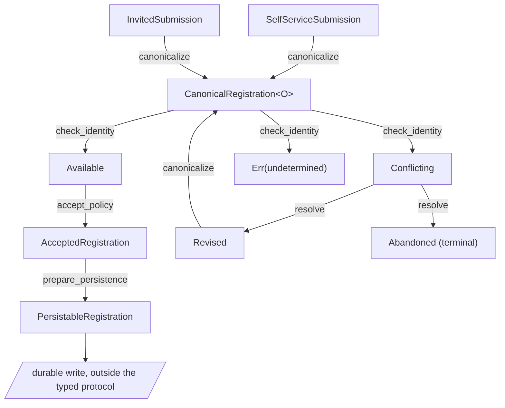

# Registration onboarding: improved design

## Stage graph



Every operation is an edge and every stage is a node; the one parallelogram is the durable write,
which leaves the typed protocol. Two entry stages, one branch with a genuine third failure
outcome, one recovery edge that re-enters at `canonicalize`, and one terminal recovery stage.

## Capabilities carry their successors

```rust
pub trait Canonicalize: Sized {
    type Next: CheckIdentity;
    type Error;

    fn canonicalize(self) -> Result<Self::Next, Self::Error>;
}

pub trait CheckIdentity: Sized {
    type Available: AcceptPolicy;
    type Conflicting: ResolveConflict;
    type Error;

    fn check_identity(
        self,
        directory: &IdentityDirectory,
    ) -> Result<IdentityOutcome<Self::Available, Self::Conflicting>, Self::Error>;
}
```

The bound `type Next: CheckIdentity` is what makes this a protocol rather than a naming
convention. It also makes the two entry paths possible without optional fields:

```rust
impl Canonicalize for SelfServiceSubmission {
    type Next = CanonicalRegistration<SelfServiceOrigin>;
    // ...
}

impl Canonicalize for InvitedSubmission {
    type Next = CanonicalRegistration<InvitedOrigin>;
    // ...
}
```

`SelfServiceOrigin` holds a challenge identifier. `InvitedOrigin` holds an invitation code and
its issuing account. Neither carries the other's fields, and both satisfy the identity check.
This addresses `RUST-DOC-0010-R003` and `RUST-DOC-0010-R004`.

## Stages carry evidence, and drop what they supersede

```rust
pub struct CanonicalRegistration<O> {
    address: EmailAddress,
    display_name: DisplayName,
    origin: O,
}
```

The raw submission strings do not survive canonicalization. After this stage there is no
`String` that a later stage might mistake for a checked value, which is `RUST-DOC-0010-R006`.
Fields are private and no public constructor exists, so the stage is reachable only by running
the transition: `RUST-DOC-0010-R010`.

Consent evidence is the sharpest case:

```rust
pub struct ConsentProof {
    version: PolicyVersion,
}
```

One private field, no public constructor. Possessing a `ConsentProof` is evidence that the policy
stage compared an offered version against the version in force. A compile-fail case proves the
literal is rejected.

## The branch is two types, not two flags

```rust
pub enum IdentityOutcome<Available, Conflicting> {
    Available(Available),
    Conflicting(Conflicting),
}
```

`AvailableRegistration<O>` implements `AcceptPolicy`. `ConflictingRegistration<O>` implements
`ResolveConflict` and does not implement `AcceptPolicy`, so the conflicting path cannot reach the
policy stage at all. This is `RUST-DOC-0010-R008`.

The undetermined case is deliberately not a third variant. A directory that could not be read is
a failure, not an outcome, and it carries the address so the attempt can be looked up:

```rust
pub struct IdentityCheckError {
    pub undetermined_for: EmailAddress,
}
```

Mapping an unreachable directory onto `Available` would advance the protocol on evidence never
obtained. That is the defect gate S25 exists to catch.

## Recovery re-enters at the right stage

```rust
pub trait ResolveConflict: Sized {
    type Revised: Canonicalize;
    type Error;

    fn resolve(self, revision: Option<RawSubmission>) -> Result<Recovery<Self::Revised>, Self::Error>;
}

impl<O: Origin> ResolveConflict for ConflictingRegistration<O> {
    type Revised = RevisedSubmission<O>;
    // ...
}
```

The bound points back at `Canonicalize`, so a revised submission re-enters at the first stage and
is canonicalized again. A revision cannot skip ahead to the check with an unnormalized address.
Abandonment produces a terminal stage with no further edges. This is `RUST-DOC-0010-R009`.

The revised stage is parameterized by the same `O`, which matters for `RUST-DOC-0010-R006`. An
invited attempt that hits a conflict and revises stays invited: it carries the original
`InvitedOrigin` forward, and the terminal value reports `OriginKind::Invited`. Collapsing every
revision into a self-service submission would have discarded the invitation evidence and
invented a challenge identifier no applicant supplied, which is precisely the evidence
fabrication `RUST-DOC-0010-R010` prohibits. A test drives an invited revision through to the
terminal stage.

## The collapsed view

```rust
let persistable = submission
    .canonicalize()?
    .check_identity(&directory)?;

let IdentityOutcome::Available(available) = persistable else {
    // conflicting branch: resolve, revise, or abandon
};

let persistable = available
    .accept_policy(offered_consent)?
    .prepare_persistence(account_id);
```

The chain is a summary, not evidence. What makes it trustworthy is that the illegal variants of
it do not compile.

## Where the typed protocol stops

`prepare_persistence` produces a `PersistableRegistration` and the typed protocol ends. It does
not write. This is the load-bearing boundary in the whole design.

The reason is `RUST-DOC-0010-R014`. A consuming transition moves a local value; a stored row is
read into a value and can be read again by another worker, so no local move consumes it. Two
concurrent attempts can each hold a consumed `AvailableRegistration` for the same address. The
availability observation was a snapshot and has already expired.

The durable step therefore lives outside the protocol and re-checks what the observation could
not guarantee:

```sql
INSERT INTO accounts (id, address, display_name, consent_version, origin_kind)
VALUES ($1, $2, $3, $4, $5)
ON CONFLICT (address) DO NOTHING
RETURNING id;
```

A unique constraint on the canonical address is the authority. Zero returned rows is a conflict
discovered at write time, which routes back into the same `ResolveConflict` stage the check-time
conflict uses. The stage graph already has a home for it because the recovery edge was modeled.

Origin evidence is erased to a runtime `OriginKind` exactly here, at the persistence boundary and
nowhere earlier, satisfying `RUST-DOC-0010-R017`. The durable record is a runtime representation,
satisfying `RUST-DOC-0010-R015`.

## Effects stay where their names say

`canonicalize`, `check_identity`, `accept_policy`, and `prepare_persistence` perform no durable
write and publish no message. The account write and the welcome notification are separate,
named, and ordered, and the notification is an at-least-once effect governed by RUST-DOC-0006
rather than a step in this protocol. This is `RUST-DOC-0010-R013`.

## Evidence

The [example crate](../../examples/staged-protocol/src/lib.rs) exercises both entry paths, both
branches, both recovery edges, the undetermined failure, stale consent, malformed input, and the
survival of canonical values across every transition. A topology assertion pins each documented
edge, so a redirected `type Next` fails the build rather than the review.

Three compiler-rejection cases under [`../../examples/compile-fail/ui/`](../../examples/compile-fail/ui/)
prove that the policy stage cannot be entered from an unchecked registration, that a consumed
stage cannot be advanced twice, that a stage cannot be cloned to duplicate progression, and
that consent evidence cannot be built from a literal.

## Guarantee ledger, one row per stage

`RUST-DOC-0010-R020` requires a row per stage, not per claim. Nonterminal stages implement
neither `Clone` nor `Copy`, so "duplicable" is `no` for every one of them and duplicate
progression is not a residual risk; the two terminal stages are duplicable because duplicating
them advances no protocol.

| Stage                        | Claim its construction establishes                        | Established by                       | Duplicable | Protected construction   | Does not prove                            | Residual runtime risk                                         |
| ---------------------------- | --------------------------------------------------------- | ------------------------------------ | ---------- | ------------------------ | ----------------------------------------- | ------------------------------------------------------------- |
| `SelfServiceSubmission`      | a self-service attempt was received with a challenge id   | caller construction from request     | no         | public fields, untrusted | that the challenge was solved             | upstream challenge verification is weak                       |
| `InvitedSubmission`          | an invited attempt was received with an invitation code   | caller construction from request     | no         | public fields, untrusted | that the invitation is genuine or unspent | upstream invitation verification is weak                      |
| `CanonicalRegistration<O>`   | address and display name are canonical under local policy | `canonicalize`                       | no         | private fields, no ctor  | mailbox existence or ownership            | provider normalization differs from the policy                |
| `AvailableRegistration<O>`   | no conflicting account was visible at check time          | `check_identity`, available branch   | no         | private fields, no ctor  | the identity is still free at write time  | competing writer inside the observation window                |
| `ConflictingRegistration<O>` | an existing account held the identity at check time       | `check_identity`, conflicting branch | no         | private fields, no ctor  | the conflict still holds, or who owns it  | the blocking account is deleted concurrently                  |
| `RevisedSubmission<O>`       | a revision was supplied, carrying the original origin     | `resolve`, revised edge              | no         | private fields, no ctor  | the revised values are canonical yet      | applicant revises to another taken identity                   |
| `AcceptedRegistration<O>`    | offered consent matched the version in force              | `accept_policy`                      | no         | private fields, no ctor  | policy is unchanged at write time         | policy changes between check and durable write                |
| `PersistableRegistration`    | the in-process protocol ran in the documented order       | `prepare_persistence` (infallible)   | yes        | private fields, no ctor  | that any row was written                  | duplicate write attempts; R014 requires the store to re-check |
| `AbandonedRegistration`      | the attempt ended without an account                      | `resolve`, abandoned edge            | yes        | private fields, no ctor  | that the applicant will not retry later   | none locally                                                  |

`ConsentProof` and `UniquenessObservation` are stage evidence rather than stages. Both have
private fields and no public constructor, so possession is proof the corresponding transition
ran; a compile-fail case pins the `ConsentProof` literal.

## Claim-level summary

| Claim                                  | Established by                                                     | Protected construction                                         | Boundary preservation                    | Escape hatches        | Does not prove                             | Residual runtime risk                                                                                          |
| -------------------------------------- | ------------------------------------------------------------------ | -------------------------------------------------------------- | ---------------------------------------- | --------------------- | ------------------------------------------ | -------------------------------------------------------------------------------------------------------------- |
| Address is canonical                   | `EmailAddress::parse` at stage one                                 | private representation                                         | raw strings dropped after the stage      | none                  | that the mailbox exists or is owned        | provider-specific normalization differences                                                                    |
| Origin evidence matches the entry path | the entry stage's implementation                                   | private field, no constructor                                  | erased to `OriginKind` only at write     | none                  | that the challenge or invitation was valid | upstream verification defect                                                                                   |
| No conflicting identity was visible    | the identity-check transition                                      | observation built only there                                   | a read, not a lock                       | none                  | that the identity is free at write time    | a competing writer inside the window                                                                           |
| Consent matched the version in force   | the policy transition                                              | one private field                                              | offered consent is untrusted input       | none                  | that the policy is unchanged at write time | policy change between check and write                                                                          |
| The in-process protocol ran in order   | consuming transitions, successor bounds, and non-duplicable stages | no public stage constructors, no `Clone` on nonterminal stages | erasure only at the persistence boundary | none                  | that any row was written                   | none locally, because consumption plus non-duplicability closes both reuse and copy; durable state is separate |
| The account row exists exactly once    | unique constraint plus conflict handling                           | database constraint                                            | the durable model is a runtime record    | administrative repair | that the notification was delivered        | ambiguous write outcome on connection loss                                                                     |

> [!TIP]
> [problem](problem.md) · [naive design](naive.md) · **improved design** · [remaining uncertainty](remaining-uncertainty.md)
> Index: [all case studies](../README.md).
> Executable mechanics live under [`../../examples/`](../../examples/).
