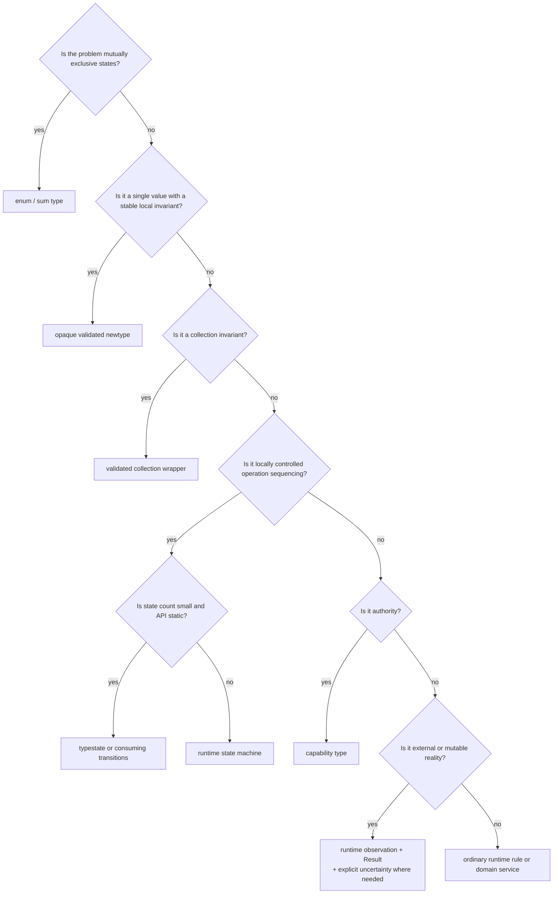

# Decision framework

## Start with the invariant

Do not begin with `struct`, `enum`, `PhantomData`, or a library. Write a falsifiable invariant,
its owner, classification, boundary, consequence, and residual uncertainty. Then ask whether
the fact is stable and local, dynamic and persisted, relational, authoritative, or external.

The first selection table is:

| Problem                               | Preferred mechanism                                |
| ------------------------------------- | -------------------------------------------------- |
| Mutually exclusive state              | `enum`                                             |
| Validated scalar or identifier        | opaque newtype                                     |
| Non-empty or bounded collection       | validated wrapper                                  |
| Locally controlled operation sequence | typestate or consuming transition                  |
| Authority to perform an operation     | capability type                                    |
| Dynamic or persisted state            | runtime enum/state machine                         |
| External input                        | runtime parse and validation                       |
| Cross-entity business rule            | domain service or transactional runtime validation |
| External success/failure              | `Result`                                           |
| Indeterminate distributed outcome     | explicit unknown/reconciliation state              |

"Preferred" means first candidate, not automatic answer. Multiple mechanisms often compose.

## Operational decision tree

Before accepting the leaf, apply complexity and honesty checks:

- Can the mechanism's proof become stale?
- Does persistence need a runtime discriminant?
- Can an external effect occur without acknowledgement?
- Does an enum already remove the contradiction more simply?
- Does a consuming method prevent the actual misuse without generic state?
- Can callers understand compiler diagnostics?
- Are all constructors and boundary decoders protected?
- What does the mechanism not prove?

## State decision

Use an enum when cases are mutually exclusive, data differs by case, state is inspected at
runtime, or persistence matters. Put only state-relevant data in each variant. Decide unknown
and future variant behavior at external boundaries.

Use a runtime transition service when legality depends on current database facts,
authorization, concurrent version, or external state. Validate expected prior status and
cross-entity invariants transactionally.

Consider typestate when all answers are favorable:

| Question                          | Favorable evidence                                               |
| --------------------------------- | ---------------------------------------------------------------- |
| Is sequencing locally controlled? | Current owner chooses every transition                           |
| Is the graph small?               | Few states and stable transitions                                |
| Is ownership natural?             | Prior state can be consumed without harming recovery             |
| Is storage unnecessary?           | Value is short-lived or runtime conversion is explicit           |
| Are callers static?               | No routine heterogeneous collection or dynamic dispatch          |
| Is failure designed?              | Transition returns prior state, error evidence, or unknown state |
| Are diagnostics usable?           | Compile-fail examples point to the domain mistake                |
| Is cost proportionate?            | Consequence exceeds API/build/maintenance cost                   |

If several answers are unfavorable, stop and use a runtime enum or consuming method.

## Value decision

Use an opaque newtype when the invariant:

- concerns one value;
- is stable enough to name;
- can be checked without mutable external state;
- is valuable after construction;
- and can be preserved through all mutations and boundaries.

Choose the evidence level before the name. For email, decide whether the type means parsed
input, a documented syntax subset, policy acceptance, ownership verification, or delivery
observation. Do not compress those levels into one `ValidEmail`.

For money, decide:

- signed, non-negative, positive, or bounded amount;
- minor-unit scale;
- currency representation;
- overflow policy;
- same-currency arithmetic;
- rounding and allocation owner;
- foreign-exchange boundary.

`u64` includes zero. `NonZeroU64` excludes zero but does not encode policy maximum or currency.

## Collection decision

Identify whether the invariant is non-empty, bounded, sorted, unique, capacity-limited, or
relational among members. A wrapper is only valid if it controls:

- vector or set creation;
- extension and insertion;
- removal and clearing;
- mutable slice or inner-container access;
- `FromIterator`;
- deserialization and database decoding.

If mutation is broad and invariant checks are cheap, an ordinary collection plus an
operation-level validator may be clearer.

## Authority decision

Use a capability when local possession should enable a narrow operation and forgery must be
hard. Record:

- issuer and protected constructor;
- resource, tenant, operation, and amount scope;
- whether cloning is valid;
- transfer and task ownership;
- serialization policy;
- expiry and revocation;
- use count;
- external recheck;
- secret handling.

If authority changes frequently and every use must query a policy engine, model the runtime
authorization decision explicitly rather than claiming durable authority.

## Boundary decision

For each HTTP DTO, message, row, file, configuration, or FFI value:

1. bound size and resource use;
2. parse into a structural representation;
3. normalize according to explicit policy;
4. validate using canonical constructors;
5. authenticate and authorize separately;
6. preserve unknown versions safely;
7. convert errors without erasing category;
8. retain operation identity for effects;
9. test invalid and historical values;
10. state what remains uncertain.

If a derive constructs private fields directly, it is a bypass unless the derive delegates to
checked conversion.

## Effect and outcome decision

Mark the external commitment point. Then classify outcomes:

| Observation                              | Domain meaning         | Retry posture                        |
| ---------------------------------------- | ---------------------- | ------------------------------------ |
| Request definitely not sent              | local failure          | retry may be safe after policy check |
| Definitive accepted response             | confirmed success      | do not repeat effect                 |
| Definitive rejected response             | confirmed rejection    | retry only if rejection is retriable |
| Sent, response lost or timed out         | unknown                | reconcile or use proven idempotency  |
| Cancellation before commitment confirmed | cancelled/non-executed | retry may be safe                    |
| Cancellation acknowledgement absent      | unknown                | reconcile                            |

Define idempotency key scope, uniqueness, retention, and replay response. If those properties
are unknown, do not label retry safe.

## Choosing a simpler mechanism

Choose ordinary runtime validation instead of a new type when:

- the fact is used once at the boundary;
- it depends on mutable external or cross-entity state;
- the invalid state has low consequence and an immediate structured error;
- a wrapper would expose unrestricted mutation;
- persistence or dynamic inspection erases the type on every operation;
- or the team cannot maintain the abstraction safely.

Choose a consuming method instead of full typestate when only double use matters. Choose an
enum instead of boolean combinations. Choose a capability instead of a broad service object
when authority surface is the concern.

## Stop conditions

Stop adding type machinery when it no longer removes a named consequential invalid program,
when state combinations multiply faster than the domain, when compiler errors cease to express
the mistake, when serialization requires pervasive erasure, or when external reality makes the
proof stale immediately.

Stop simplifying when a public bypass remains, the same invariant is scattered across
callers, wrong-state effects are plausible and severe, or an unknown outcome is still forced
into success/failure.

The final decision includes a guarantee ledger, boundary map, evidence plan, and a trigger for
revisiting the representation.
