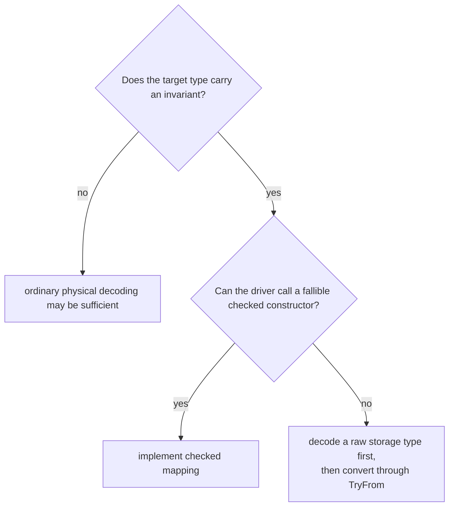
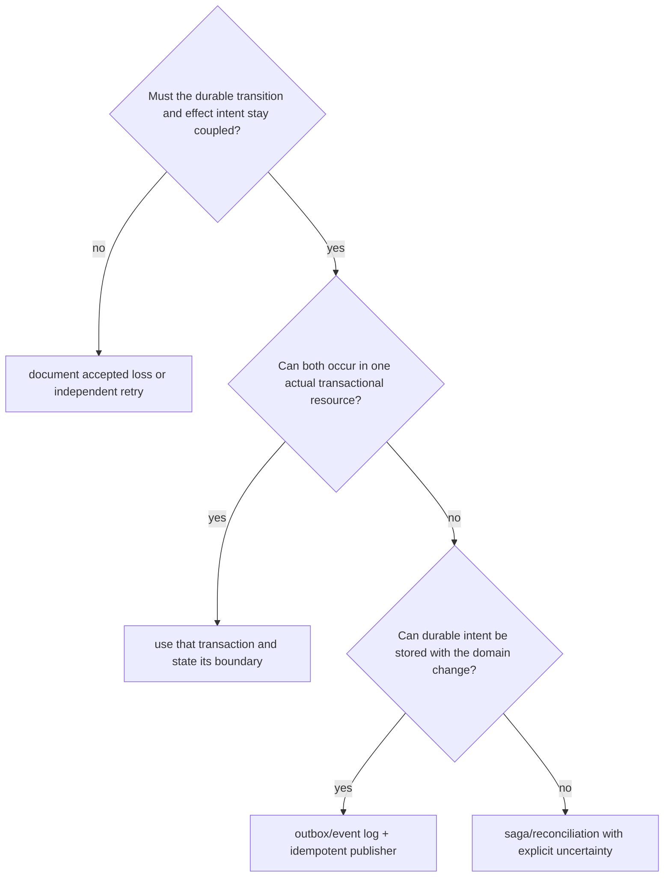

# Decision framework

## Inventory the persistence contract

For each durable representation record:

- owner and alternate writers;
- physical format and schema version;
- domain type constructed;
- fields whose meanings differ;
- maximum lifetime;
- rolling-upgrade and downgrade needs;
- constraints and transaction isolation;
- invalid-data behavior;
- external effects coupled to writes;
- recovery, backup, and replay paths.

## Select one or two models

Use one Rust model only when storage and domain contracts are identical:
nullability, valid values, normalization, compatibility, and public exposure all
match. Otherwise use:

```text
StoredRow
    ↓ decode physical types
RawRecord
    ↓ TryFrom + current invariant validation
DomainEntity
```

On conversion failure retain a diagnostic representation rather than partially
constructing the domain entity.

## Choose invariant enforcement

| Invariant                   | Primary mechanism            | Reinforcement                 |
| --------------------------- | ---------------------------- | ----------------------------- |
| positive scalar             | private newtype constructor  | SQL check constraint          |
| unique business key         | domain conflict type         | unique constraint             |
| valid foreign reference     | repository/domain rule       | foreign key                   |
| state-associated fields     | sum-type conversion          | discriminator checks          |
| cross-row balance           | transactional service        | isolation, locks, constraints |
| current-write version       | optimistic predicate         | version column                |
| volatile eligibility policy | transactional domain service | audit record                  |

If the database cannot enforce an invariant, state the race and repair model.

## Decode decision



Reject any solution that writes private fields through unsafe code for
convenience.

## Migration decision

Classify the change:

- representation-only;
- invariant preserving;
- invariant strengthening;
- invariant weakening;
- evidence transformation;
- state split or merge;
- destructive history change.

For strengthening, scan all rows before enforcement. For evidence
transformation, define how new evidence is established; do not synthesize it.
For rolling deployments, define old-reader/new-writer and new-reader/old-writer
compatibility. Prefer forward repair when rollback would reinterpret new data
incorrectly.

## Concurrency decision

For each read-modify-write:

1. identify concurrent writers;
2. name the anomaly that matters using the package glossary;
3. choose a constraint, atomic update, optimistic version, lock, or isolation
   level;
4. name the residual anomaly set for the selected product and configuration;
5. preserve conflict as a structured result;
6. test at least two competing operations;
7. define caller retry and deadline.

Last-write-wins requires explicit business acceptance, not absence of a version
column.

## Persistence plus effect decision



Never call compensation rollback. Compensation is a new fallible effect.

## Invalid-data decision

Choose among:

- reject and fail the operation;
- quarantine record with identity and diagnostics;
- expose a separate degraded/invalid read model;
- run an audited repair migration;
- restore from verified source.

Do not replace invalid evidence with a guessed default. If availability requires
partial reads, ensure the partial type cannot enter trusted business operations.

## Stop conditions

Stop the design if:

- a trusted type has any decoding bypass;
- migration creates evidence it did not observe;
- enum encoding depends on unstable source names without policy;
- transaction isolation is assumed rather than matched to an invariant;
- update conflicts disappear into affected-row count zero;
- external effects are described as database-atomic;
- commit errors are all mapped to rollback;
- outbox delivery is described as exactly once without boundary-specific proof.
