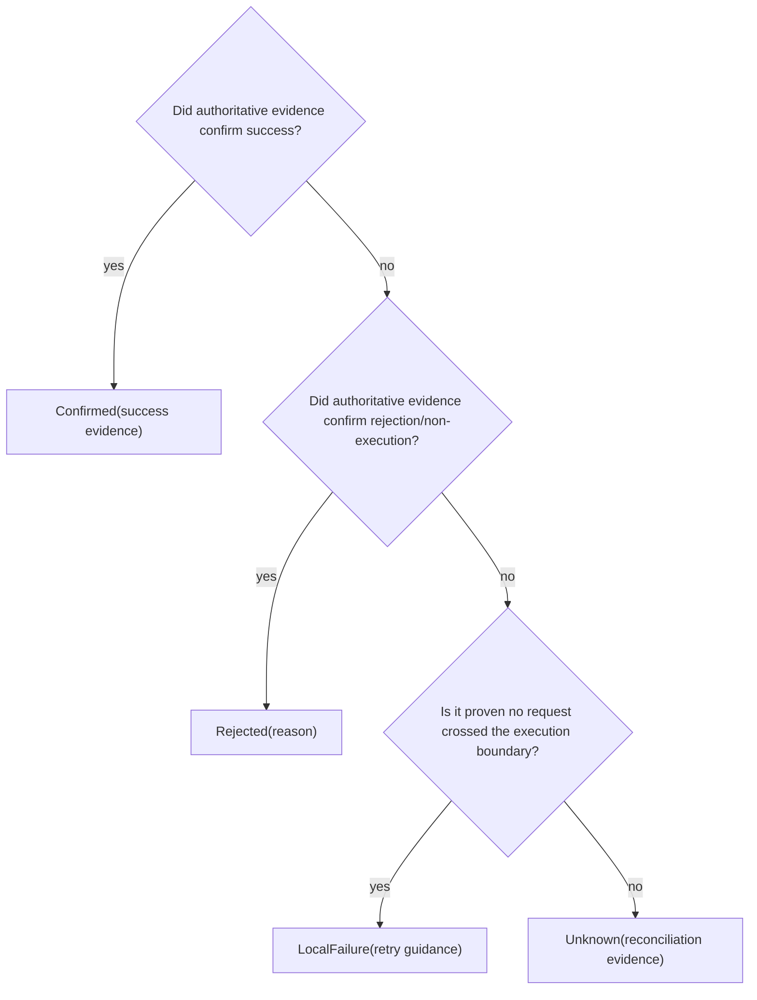

# Decision framework

## Build an effect inventory

For every external operation record:

- logical intent and stable operation identity;
- target system and resource;
- point after which execution may have occurred;
- response and acknowledgement evidence;
- timeout and cancellation semantics;
- natural idempotency, key-based idempotency, or deduplication;
- retry owner and attempt budget;
- unknown-outcome representation;
- reconciliation source and owner;
- compensation, if any;
- audit and sensitive-data requirements.

## Classify each failure point

| Failure point                                   | Knowledge                                        | Default action                              |
| ----------------------------------------------- | ------------------------------------------------ | ------------------------------------------- |
| local validation before dispatch                | no request sent                                  | correct or reject                           |
| admission rejection with authenticated response | confirmed rejection                              | do not blind retry unless condition changes |
| connection failure before any bytes can be sent | likely local failure, subject to transport proof | safe retry if established                   |
| failure after request may be received           | execution unknown                                | reconcile or idempotent replay              |
| authenticated success response                  | confirmed at response boundary                   | persist evidence                            |
| acknowledgement loss after consumer effect      | effect may repeat                                | deduplicate on redelivery                   |

Do not infer exact transport timing without support from the library and
protocol.

## Outcome decision tree



## Idempotency decision

Ask in order:

1. Does repeating the complete effect set yield the same state and acceptable
   response?
2. If not, can the receiver atomically bind an operation key to the effect?
3. Does the key cover concurrent duplicate attempts?
4. Is the request payload bound to the key?
5. Is retention longer than every replay and retry horizon?
6. Can external effects occur outside that atomic boundary?
7. What happens after expiry?

If any consequential effect remains outside the idempotent boundary, unknown
outcomes still require reconciliation.

## Retry decision

| Classification                       | Permitted behavior                                   |
| ------------------------------------ | ---------------------------------------------------- |
| safe retry                           | reuse operation identity within remaining budget     |
| unsafe retry                         | stop and escalate                                    |
| reconcile before retry               | observe authoritative state, then decide             |
| confirmed rejection                  | retry only after documented condition changes        |
| rate/overload response               | honor server guidance, backoff, jitter, cap attempts |
| authentication/authorization failure | repair authority; do not storm                       |

Calculate multiplication across callers, middleware, proxies, workers, and
libraries. One logical deadline constrains all layers.

## Consumer decision

Choose an acknowledgement position by examining crash points:

```text
receive
  ↓
claim/deduplicate
  ↓
perform local or external effect
  ↓
record outcome/progress
  ↓
acknowledge
```

For a local database effect, combine inbox claim, effect, and progress in one
transaction where possible. For an external effect, persist operation identity
and unknown state before attempting, then reconcile ambiguous outcomes.

## Ordering decision

Identify the required relationship:

- no order;
- per-producer order;
- per-aggregate version order;
- causal predecessor;
- partition order;
- total order.

Prefer versions and stale-write rejection when they express the invariant more
directly than delivery order. Define duplicate and gap behavior.

## Reconciliation design

A reconciliation record should contain:

| Field               | Purpose                                     |
| ------------------- | ------------------------------------------- |
| operation ID        | stable logical identity                     |
| external key        | provider lookup/deduplication               |
| request fingerprint | compare intent without unnecessary raw data |
| target              | select authoritative source                 |
| first/last attempt  | timeline                                    |
| observation cursor  | resume progress                             |
| next action time    | bounded scheduling                          |
| attempt count       | escalation                                  |
| current evidence    | explain state                               |
| owner               | operational accountability                  |

Define confirmed terminal transitions and a still-unknown path. Human override
must be audited as new evidence or a policy decision, never retroactive proof.

## Stop conditions

Stop and redesign when:

- timeout maps directly to rejection;
- retry generates a new idempotency key;
- same key with different payload has no conflict rule;
- deduplication is volatile but protects a durable effect;
- acknowledgement can precede required durable evidence without accepted loss;
- exactly-once language lacks a boundary;
- compensation is assumed infallible;
- lease ownership lacks fencing where stale workers can harm;
- unknown outcomes have no durable owner;
- audit data contains avoidable secrets.
