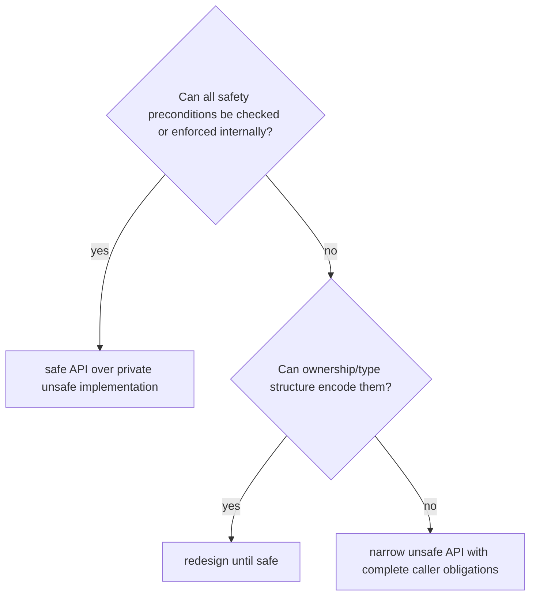

# Decision framework

## Establish necessity

Ask:

1. What capability is unavailable in safe Rust?
2. Can ownership, borrowing, an enum, a checked index, or a maintained safe
   dependency supply it?
3. Is performance the reason, and is the bottleneck measured?
4. Can unsafe remain in one private module?
5. Who can review the relevant aliasing, ABI, or concurrency model?
6. Which targets and toolchains must be supported?
7. What happens when a premise changes?

If the need is only to silence a borrow error, redesign ownership first.

## Build the proof table

For every unsafe operation record:

| Obligation            | Evidence                                        |
| --------------------- | ----------------------------------------------- |
| allocation/provenance | originating allocation or foreign contract      |
| bounds                | checked range and overflow handling             |
| alignment             | type/layout contract or runtime check           |
| initialization        | construction state and exact initialized region |
| validity              | bit-pattern validation before typed observation |
| aliasing              | all references and mutation authority           |
| lifetime              | owner and destruction order                     |
| concurrency           | synchronization and thread contract             |
| panic/drop            | every partial state and destructor path         |
| target/ABI            | supported platforms and primary specification   |

Any unanswered applicable row blocks implementation.

## Choose the API boundary

Do not make an API safe by moving obligations into prose.

## FFI decision sequence

1. Generate or verify declarations against the authoritative headers.
2. Define ABI and target matrix.
3. Use stable boundary representations and opaque handles.
4. Record pointer nullability, length units, mutability, and ownership.
5. Pair every allocation with the correct deallocator.
6. Define string encoding and interior-null behavior.
7. Define callback retention, thread, and reentrancy.
8. translate foreign errors without losing categories;
9. prevent incompatible unwinding;
10. expose a safe wrapper only after obligations are enforced.

## Initialization decision

Prefer ordinary safe initialization. Use `MaybeUninit` only when required by
FFI, array construction, or measured cost. Track initialized elements with a
guard. Review zero-length, zero-sized, allocation-failure, element-constructor
failure, and panic paths. Convert to initialized `T` only once.

## Concurrency decision

Before unsafe `Send` or `Sync`, enumerate:

- all fields, raw targets, and aliases;
- allowed methods through shared and exclusive access;
- mutation synchronization;
- callback threads and reentrancy;
- destruction concurrency;
- foreign library guarantees;
- thread-local or affinity requirements;
- cancellation and panic effects.

If any upstream thread guarantee is missing, keep the wrapper non-`Send` or
non-`Sync`.

## Evidence matrix

| Risk                          | Useful evidence                            |
| ----------------------------- | ------------------------------------------ |
| pointer validity and aliasing | Miri, fuzzing, targeted tests              |
| address and bounds defects    | AddressSanitizer                           |
| data races                    | ThreadSanitizer, Loom for modeled code     |
| uninitialized reads           | MemorySanitizer where supported, Miri      |
| FFI layout                    | bindgen/layout tests, C-side assertions    |
| panic safety                  | injected panics and drop counters          |
| target assumptions            | cross-target CI or hardware tests          |
| performance justification     | benchmark and profiler under RUST-DOC-0009 |

Tool limitations must be recorded.

## Stop conditions

Stop when:

- safety explanation repeats syntax rather than premises;
- a safe caller must obey an undocumented rule;
- layout is inferred from current observation;
- a raw address is treated as provenance;
- `MaybeUninit` has no partial-drop plan;
- transmute replaces a narrower conversion;
- FFI ownership or allocator is unspecified;
- callback lifetime is guessed;
- unsafe `Send`/`Sync` lacks an upstream thread contract;
- performance improvement is unmeasured;
- reviewers cannot explain the proof.
