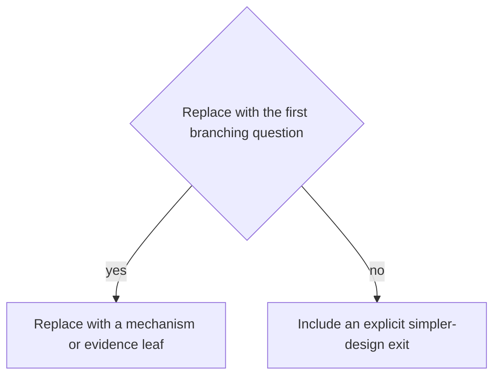

# Decision framework: <Replace with doctrine title>

## Inputs

Require the invariant inventory, trust-boundary map, state graph, authority map,
external-effect inventory, persistence model, complexity budget, and evidence
plan as relevant.

## Questions

1. <What consequential invalid state or program exists?>
2. <Is the fact local and stable, cross-entity, temporal, or external?>
3. <Who controls construction and transition?>
4. <Which mechanism is simplest and sufficient?>
5. <How is evidence re-established at decoding boundaries?>
6. <Which outcomes remain fallible or unknown?>
7. <What evidence would disprove the design?>

## Decision table

| Situation       | Preferred mechanism | Conditions     | Stop condition                            |
| --------------- | ------------------- | -------------- | ----------------------------------------- |
| <Problem class> | <Mechanism>         | <When it fits> | <When to choose simpler/different design> |

## Decision tree

Write an operational tree whose leaves select mechanisms or require more
evidence, as a `mermaid` flowchart when the logic branches or a `text` block
when it is a short linear sequence. Include an explicit simpler-design exit.

## Complexity check

<Assess state/transition count, public signatures, serialization, persistence,
async behavior, trait bounds, diagnostics, compile/build cost, runtime cost,
migration, and team operation.>

## Evidence selection

<Map each decision to positive, negative, boundary, fault, concurrency, model,
unsafe, performance, and operational evidence as applicable.>
